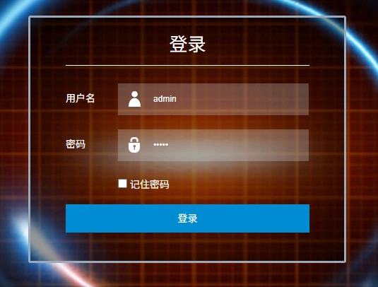
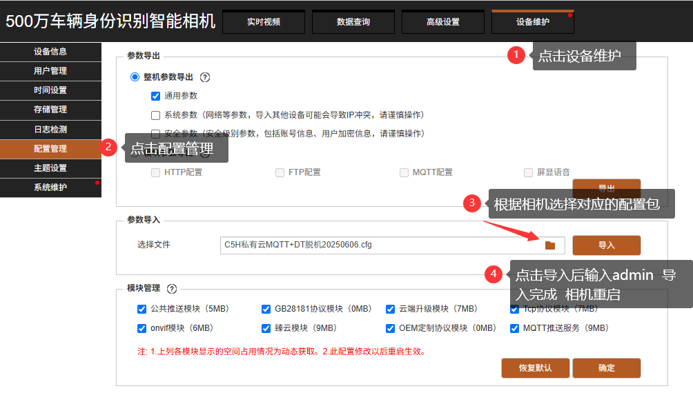
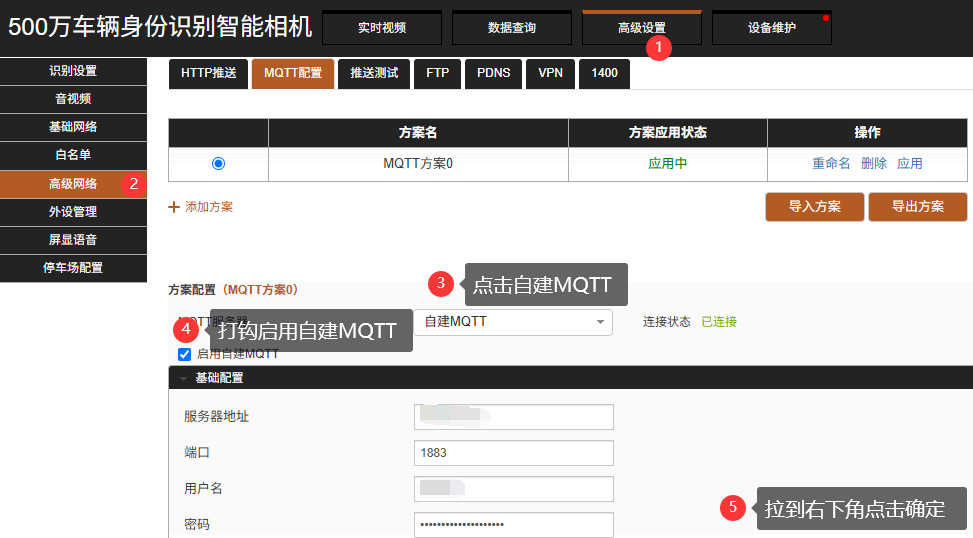
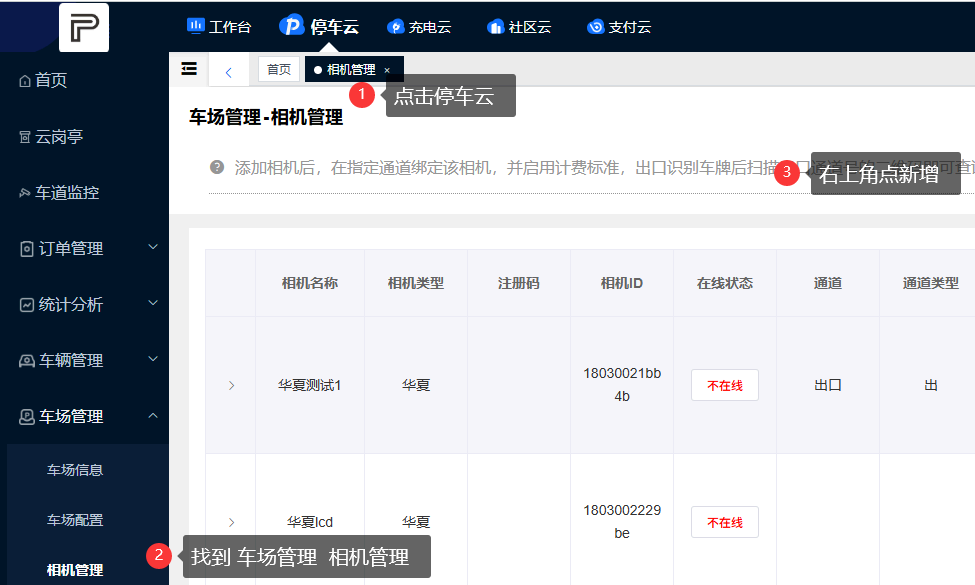
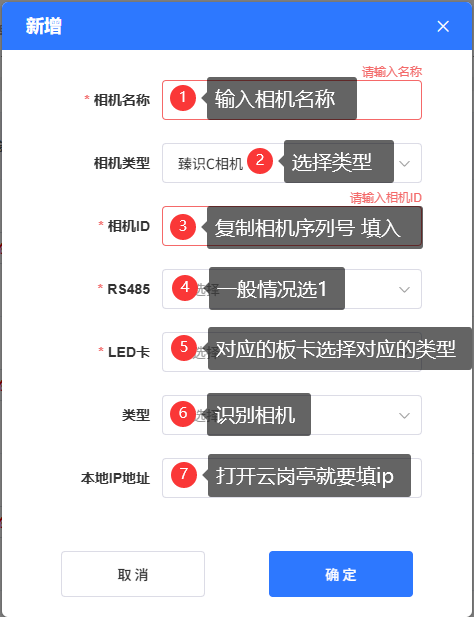
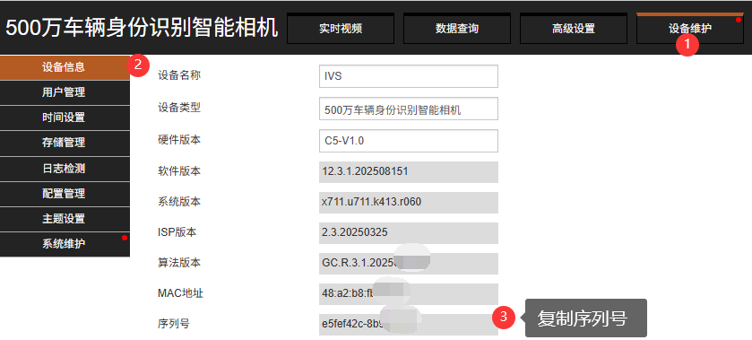

# C5H上云方式
:::danger 危险
不要使用360浏览器，推荐<a href="https://www.google.cn/intl/zh-CN/chrome/" target="_blank">谷歌浏览器（点击下载）</a>！！！
:::

## 一、相机登录
1. 打开浏览器，输入相机 IP 地址（默认地址：192.168.1.100）
2. 输入登录信息，账号 / 密码均为：admin
3. 可勾选「记住密码」，点击登录完成操作

## 二、配置包导入
1. 相机登录后，点击菜单栏**设备维护**
2. 在设备维护页面，选择**配置管理**
3. 配置包获取方式：联系技术员获取 / 点开小助手的上云文件获取
4. 点击**参数导入** → **选择文件**，选中对应配置包（示例：C5H私有云MQTTDT脱机20250606.cg）
5. 点击**导入**，输入验证密码`admin`，等待导入完成后相机会自动重启

## 三、MQTT配置
1. 相机重启完成后，点击菜单栏**高级设置**
2. 打开**高级网络**，选择**MQTT配置**
3. MQTT方案选择**自建MQTT**，勾选**启用自建MQTT**
4. 基础配置保持默认（端口：1883），点击**确定**保存

## 四、平台添加相机
1. 登录平台后，点击**停车云** → **车场管理** → **相机管理**
2. 点击**新增**，填写相机名称、类型（臻识C相机）、相机ID（序列号）等信息
3. 点击**确定**完成添加

## 五、通道绑定
1. 在对应车场中**新建通道**
2. 将相机绑定至通道

